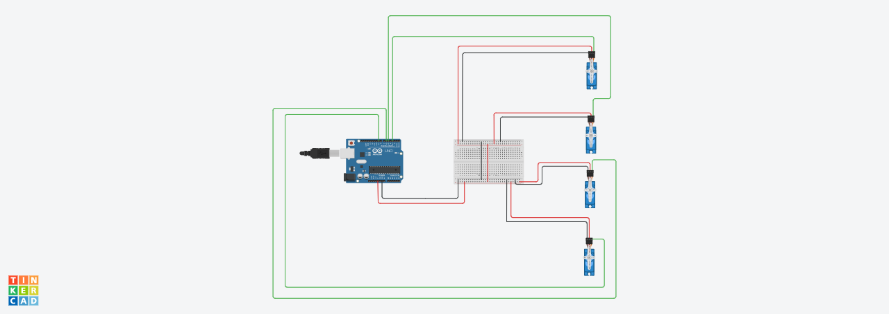

# four-servo-motors-task
An Arduino project that controls four servo motors with a sweep motion for 2 seconds, then holds them at 90 degrees.

## Project Overview

This project controls four servo motors using one Arduino Uno.

The motors perform a sweep motion for 2 seconds. After that, all servo motors move to 90 degrees and remain fixed.

## Components Used

- Arduino Uno
- Breadboard
- 4 Servo Motors
- Jumper Wires

## Pins Used

| Servo Motor | Arduino Pin |
|---|---|
| Servo 1 | Pin 3 |
| Servo 2 | Pin 5 |
| Servo 3 | Pin 6 |
| Servo 4 | Pin 9 |

## Circuit Design

## Simulation Video

[▶ Watch the Servo Motors Simulation](simulation-video.mp4)

## How It Works

1. The four servo motors start moving together.
2. They perform a sweep motion for 2 seconds.
3. After 2 seconds, all motors move to 90 degrees.
4. The motors remain fixed at 90 degrees.

## Files

- `four_servo_motors.ino` - Arduino code
- `Circuit connection.png` - Circuit connection image
- `simulation-video.mp4` - Simulation video
- `README.md` - Project description

## Tools Used

- Tinkercad
- GitHub

## Conclusion

This task demonstrates how to control four servo motors using one Arduino Uno and a breadboard.
